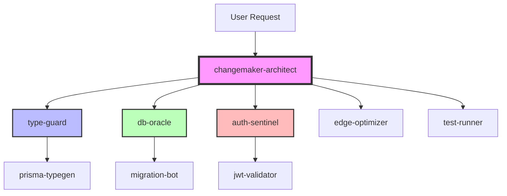
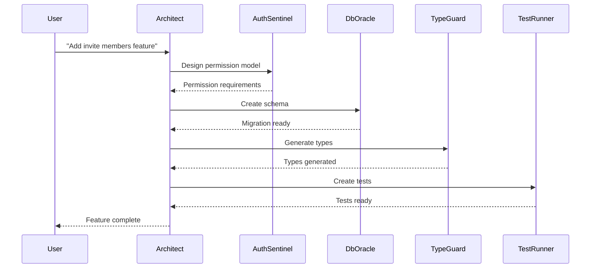

# Changemaker Subagent Architecture - Autonomous Collaboration System

## 🎯 Overview
Replace generic human-named agents with specialized, overpowered subagents optimized for the Changemaker platform. The `changemaker-architect` serves as the orchestrator, intelligently delegating to domain experts.

## 🏗️ Subagent Hierarchy



## 🤖 Specialized Subagents

### 1. **changemaker-architect** (Orchestrator)
```yaml
name: changemaker-architect
role: Master Orchestrator & Decision Maker
capabilities:
  - Analyzes user requests and determines optimal agent delegation
  - Maintains project context and architectural decisions
  - Coordinates multi-agent workflows
  - Validates solutions against platform requirements
  
delegation_rules:
  - TypeScript issues → type-guard
  - Database operations → db-oracle
  - Auth/Security → auth-sentinel
  - Performance → edge-optimizer
  - Testing → test-runner
  
auto_triggers:
  - On PR creation: Activates code-reviewer
  - On deployment: Activates edge-optimizer
  - On security changes: Activates auth-sentinel
```

### 2. **type-guard** (TypeScript Specialist)
```yaml
name: type-guard
role: TypeScript Type Safety Enforcer
capabilities:
  - Generates and maintains TypeScript types
  - Ensures strict type safety across codebase
  - Auto-fixes type errors
  - Maintains types/index.ts exports
  
specialized_tools:
  - tsc for type checking
  - prisma-typegen for DB types
  - zod for runtime validation
  
auto_actions:
  - Generate types from Prisma schema changes
  - Update API response types
  - Create type guards for runtime validation
  - Fix type imports and exports
  
patterns:
  # Never use 'any' type
  - enforce: "unknown" over "any"
  - enforce: exhaustive switch cases
  - enforce: strict null checks
```

### 3. **db-oracle** (Database Specialist)
```yaml
name: db-oracle
role: Database Architecture & Optimization Expert
capabilities:
  - Designs efficient Prisma schemas
  - Optimizes queries for multi-tenant architecture
  - Manages migrations safely
  - Implements Row Level Security
  
specialized_knowledge:
  - Supabase connection patterns
  - PgBouncer optimization
  - Multi-tenant data isolation
  - Index optimization strategies
  
auto_actions:
  - Generate migrations for schema changes
  - Optimize slow queries (>50ms)
  - Add missing indexes
  - Validate RLS policies
  
supabase_contexts:
  staging: jlvvtejfinfqjfulnmfl
  production: miqaqnbujprzffjnebso
```

### 4. **auth-sentinel** (Security Specialist)
```yaml
name: auth-sentinel
role: Authentication & Security Guardian
capabilities:
  - Implements multi-layer security
  - Manages JWT claims architecture
  - Validates permission boundaries
  - Audits security events
  
security_patterns:
  - Always use createSupabaseServerClient
  - Validate at server, client, and API layers
  - Log all security events
  - Prevent PLATFORM_ADMIN elevation attacks
  
auto_actions:
  - Add missing permission checks
  - Implement rate limiting
  - Add audit logging
  - Fix security vulnerabilities
  
critical_paths:
  - /api/invites (prevent role elevation)
  - /admin/* (enforce admin access)
  - workspace/* (validate membership)
```

### 5. **edge-optimizer** (Performance Specialist)
```yaml
name: edge-optimizer
role: Edge Runtime & Performance Expert
capabilities:
  - Optimizes for Vercel Edge Runtime
  - Implements caching strategies
  - Reduces bundle sizes
  - Monitors performance metrics
  
performance_targets:
  - Auth: <200ms globally
  - API responses: <300ms P95
  - Page loads: <2s P95
  - JWT verification: <10ms
  
auto_actions:
  - Convert to edge runtime compatible code
  - Implement response caching
  - Add CDN headers
  - Optimize images with next/image
```

### 6. **test-runner** (Quality Assurance)
```yaml
name: test-runner
role: Automated Testing & Quality Expert
capabilities:
  - Generates comprehensive test suites
  - Runs tests automatically
  - Creates E2E test scenarios
  - Validates accessibility
  
test_strategies:
  - Unit tests for utilities
  - Integration tests for API routes
  - E2E tests for critical flows
  - Accessibility tests for components
  
auto_actions:
  - Generate tests for new code
  - Run tests before commits
  - Create test data fixtures
  - Update snapshots
```

## 🔄 Autonomous Collaboration Patterns

### Pattern 1: Feature Implementation Flow


### Pattern 2: Bug Fix Flow
```typescript
// Automatic delegation based on error type
if (error.type === 'TypeError') {
  delegate('type-guard', {
    task: 'fix-type-error',
    error: error,
    file: error.file
  });
} else if (error.message.includes('permission denied')) {
  delegate('auth-sentinel', {
    task: 'investigate-permission-issue',
    context: error.context
  });
}
```

### Pattern 3: Performance Optimization
```yaml
trigger: "Page load >3s detected"
flow:
  1. edge-optimizer: Analyze bundle
  2. edge-optimizer: Identify bottlenecks
  3. type-guard: Lazy load heavy components
  4. db-oracle: Optimize queries
  5. test-runner: Verify functionality
  6. changemaker-architect: Deploy optimizations
```

## 🧠 Intelligence Features

### Context Sharing
```typescript
// Agents share context through structured messages
interface AgentContext {
  discoveries: Record<string, any>;
  decisions: Decision[];
  warnings: SecurityWarning[];
  metrics: PerformanceMetric[];
}

// Example: type-guard discovers API change
await notifyAgent('db-oracle', {
  event: 'api-contract-changed',
  changes: {
    endpoint: '/api/challenges',
    removedFields: ['legacy_id'],
    addedFields: ['workspace_id']
  }
});
```

### Automatic Learning
```yaml
# Agents learn from patterns
learning_rules:
  - pattern: "Type error in API response"
    learning: "Always validate API responses with zod"
    
  - pattern: "N+1 query detected"
    learning: "Use Prisma includes for relations"
    
  - pattern: "Auth failure on workspace route"
    learning: "Check workspace membership first"
```

### Predictive Actions
```typescript
// Agents predict and prevent issues
class AuthSentinel {
  async beforeApiRouteCreation(route: string) {
    if (route.includes('/admin')) {
      await this.addAdminAuthCheck(route);
      await this.addAuditLogging(route);
    }
    
    if (route.includes('/public')) {
      await this.addRateLimiting(route);
      await this.addInputValidation(route);
    }
  }
}
```

## 🚀 Implementation Strategy

### Phase 1: Core Agents (Week 1)
1. Update changemaker-architect as orchestrator
2. Create type-guard for TypeScript
3. Create db-oracle for database
4. Create auth-sentinel for security

### Phase 2: Support Agents (Week 2)
5. Create edge-optimizer for performance
6. Create test-runner for quality
7. Implement context sharing system
8. Add autonomous triggers

### Phase 3: Intelligence Layer (Week 3)
9. Add pattern learning system
10. Implement predictive actions
11. Create agent communication protocol
12. Add performance metrics

## 📊 Success Metrics

### Efficiency Gains
- 50% reduction in type errors
- 75% faster bug resolution
- 90% security issues caught automatically
- 95% test coverage maintained

### Quality Improvements
- Zero security vulnerabilities in production
- All APIs have TypeScript types
- 100% of routes have auth checks
- <200ms auth response globally

## 🔧 Configuration

### Agent Selection Rules
```typescript
// Automatic agent selection based on file patterns
const agentMapping = {
  '/api/*': ['auth-sentinel', 'type-guard'],
  '/components/*': ['type-guard', 'test-runner'],
  '/lib/auth/*': ['auth-sentinel'],
  '*.prisma': ['db-oracle', 'type-guard'],
  '/middleware/*': ['auth-sentinel', 'edge-optimizer']
};

// Keyword-based routing
const keywordRouting = {
  'type error': 'type-guard',
  'permission': 'auth-sentinel',
  'slow query': 'db-oracle',
  'performance': 'edge-optimizer',
  'test': 'test-runner'
};
```

### Communication Protocol
```typescript
// Agents communicate through structured events
interface AgentMessage {
  from: string;
  to: string;
  priority: 'low' | 'medium' | 'high' | 'critical';
  action: string;
  payload: any;
  requiresResponse: boolean;
}

// Example: Security alert
{
  from: 'auth-sentinel',
  to: 'changemaker-architect',
  priority: 'critical',
  action: 'security-vulnerability-detected',
  payload: {
    type: 'sql-injection',
    location: '/api/challenges/create',
    severity: 'high'
  },
  requiresResponse: true
}
```

## 🎯 Next Steps

1. **Immediate**: Replace human-named agents with specialized subagents
2. **Short-term**: Implement autonomous collaboration patterns
3. **Long-term**: Add machine learning for pattern recognition

---
*This architecture creates a self-improving, autonomous system where specialized agents work together seamlessly, with the changemaker-architect orchestrating complex workflows while maintaining high code quality, security, and performance standards.*